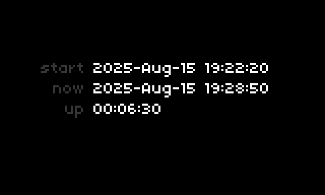
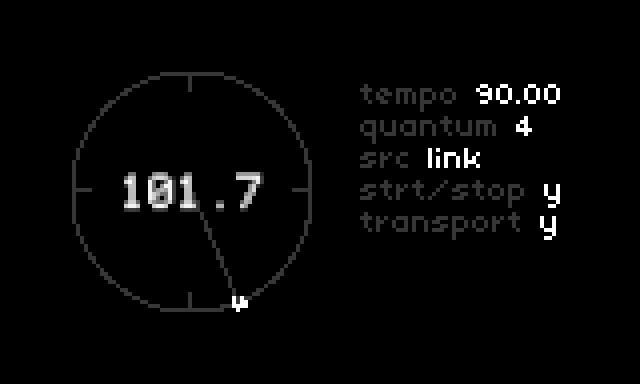

-*- mode: org; mode: visual-line; -*-
#+STARTUP: indent

* =cassiel-norns-101=

Some simple studies for Norns and Lua. So far:

** =uptime=

- A simple clock and uptime display.

** =clock-follow=

- Experiments with Ableton Link synchronisation: a rotary time display according to link quantum.
